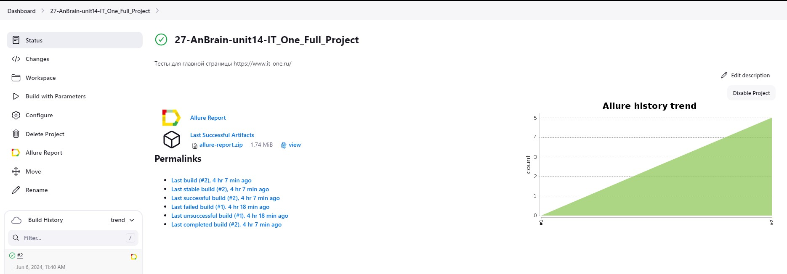
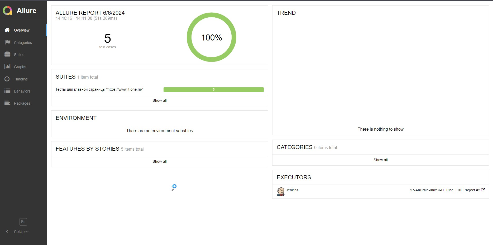
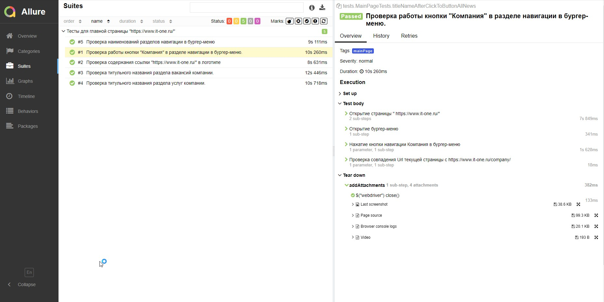
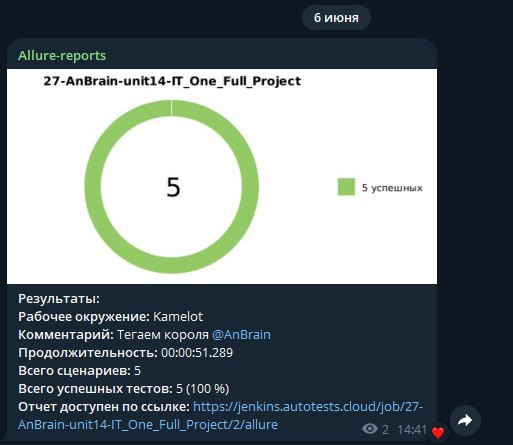
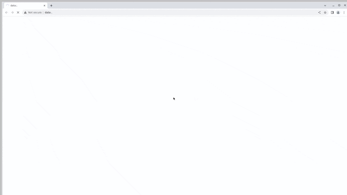

# Проект по автоматизации тестирования для компании [IT-One](https://www.it-one.ru/)
> IT_ONE — современная гибкая компания, обладающая преимуществом использования новейших технологий и процессов. IT_ONE нацеленa на ускорение темпов роста цифровизации нашей страны с помощью новейших информационных технологий и ведущих мировых практик.
## :scroll: Содержание:
- [Используемый стек](#computer-используемый-стек)
- [Реализованные проверки](#ballot_box_with_check-реализованные-проверки)
- [Сборка в Jenkins](#-сборка-в-jenkins)
- [Пример Allure-отчета](#-пример-allure-отчета)
- [Уведомления в Telegram с использованием бота](#-уведомления-в-telegram-с-использованием-бота)
- [Видео примера запуска тестов в Selenoid](#-видео-примера-запуска-тестов-в-selenoid)
  
## :computer: Используемый стек
<p align="center">


</p>

- В данном проекте автотесты написаны на языке <code>Java</code> с использованием фреймворка для тестирования Selenide. 
- В качестве сборщика был использован - <code>Gradle</code>.  
- Использованы фреймворки <code>JUnit 5</code> и [Selenide](https://selenide.org/).
- При прогоне тестов браузер запускается в [Selenoid](https://aerokube.com/selenoid/).
- Для удаленного запуска реализована джоба в <code>Jenkins</code> с формированием Allure-отчета и отправкой результатов в <code>Telegram</code> при помощи бота. 

Содержание Allure-отчета:
* Шаги теста;
* Скриншот страницы на последнем шаге;
* Page Source;
* Логи браузерной консоли;
* Видео выполнения автотеста.

## :ballot_box_with_check: Реализованные проверки:

- Проверка содержания ссылки "https://www.it-one.ru/" в логотипе
- Проверка наименований разделов навигации в бургер-меню
- Проверка титульного названия раздела услуг компании
- Проверка титульного названия раздела вакансий компании
- Проверка работы кнопки "Компания" в разделе навигации в бургер-меню

  
##  Сборка в Jenkins

* <code>BROWSER</code> – браузер, в котором будут выполняться тесты. По умолчанию - <code>chrome</code>.
* <code>BROWSER_VERSION</code> – версия браузера, в которой будут выполняться тесты. По умолчанию - <code>121.0</code>.
* <code>BROWSER_SIZE</code> – размер окна браузера, в котором будут выполняться тесты. По умолчанию - <code>1920x1080</code>.
* <code>SELENOID_URL</code> – Url, адрес удаленного сервера, на котором будут запускаться тесты. По умолчанию - <code>selenoid.autotests.cloud</code>.

<a id="console"></a>
### Команды для запуска из терминала
___
***Локальный запуск:***
```bash
gradle clean test main_page_tests
-"Dbrowser=${BROWSER}"
-"Dsize=${BROWSER_SIZE}"
-"Dversion=${BROWSER_VERSION}"
-"Dselenoid=${SELENOID_URL}"
```
При выполнении данной команды в терминале IDE тесты запустятся удаленно в <code>Selenoid</code>.

***Удалённый запуск через Jenkins:***
```bash  
clean test main_page_tests
-"Dbrowser=${BROWSER}"
-"Dsize=${BROWSER_SIZE}"
-"Dversion=${BROWSER_VERSION}"
-"Dselenoid=${SELENOID_URL}"
```
Для запуска сборки необходимо перейти в раздел <code>Собрать с параметрами</code> и нажать кнопку <code>Собрать</code>.
<p align="center">

</p>
После выполнения сборки, в блоке <code>История сборок</code> напротив номера сборки появятся значки <code>Allure Report</code> и <code>Allure TestOps</code>, при клике на которые откроется страница с сформированным html-отчетом и тестовой документацией соответственно.

##  Пример Allure-отчета


## Основная страница отчёта

<p align="center">  
  
</p>  

## Тест-кейсы

<p align="center">  
  
</p>

###  Уведомления в Telegram с использованием бота

После завершения сборки специальный бот, созданный в <code>Telegram</code>, автоматически обрабатывает и отправляет сообщение с отчетом о прогоне тестов.

<p align="center">

</p>

###  Видео примера запуска тестов в Selenoid

В отчетах Allure для каждого теста прикреплен не только скриншот, но и видео прохождения теста
<p align="center">
  
</p>
